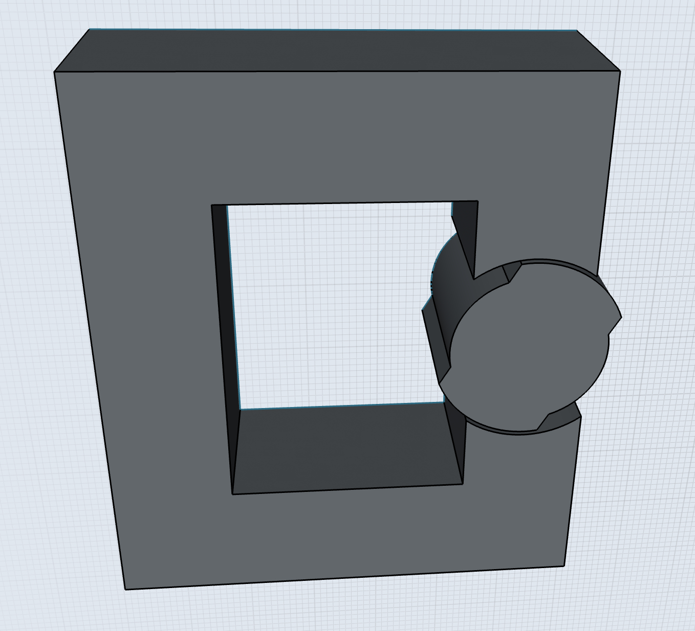
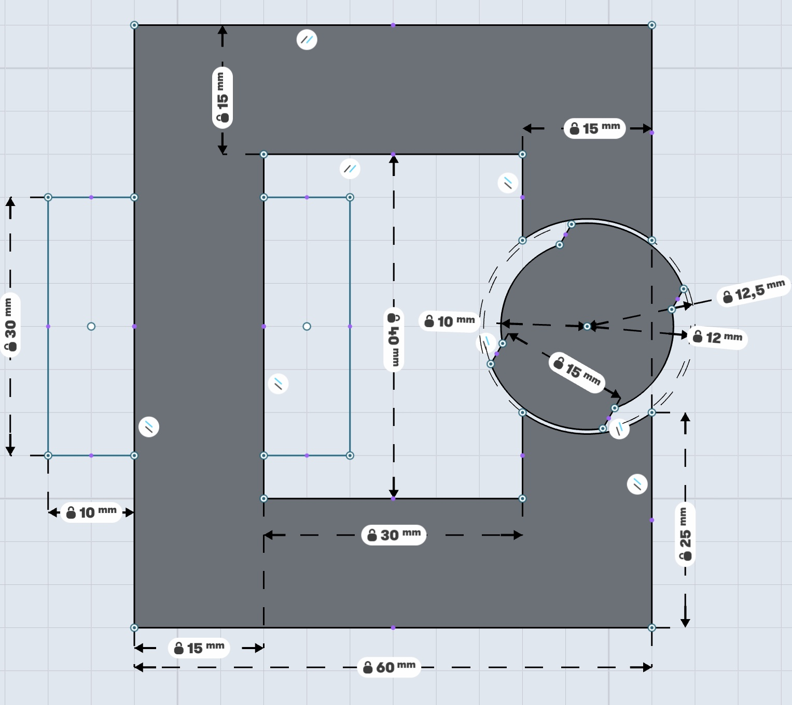

# EE564 Project-1

## Torque in a Variable Reluctance Machine

## Deadline 08/03 23:59

## Grading and Procedure

See the [Evaluation](./evaluation.md) sheet for details.

Assume you have a variable reluctance machine as shown in the figures below:

- Coils are wound within 30mmx10mm rectangle areas
- Each airgap clearance is 0.5mm
- Depth of the core is 20mm
- Number of turns = 250
- Coil Current = 3 A DC

## Q1) Analytical modelling

a) Derive an analytical formula for the reluctance and the inductance of the system as a function of rotation of the variable reluctance rotor. You may assume the core is infinitely permeable for this section. You may have other other assumptions, but please indicate them clearly.

b) Derive and plot the torque generated in the system under constant DC excitation.

c) Suggest a method to improve your model by including non-linear effects (fringing flux, non-homogeneous flux distribution) etc.

## Q2) FEA Modelling (2D - Linear Materials)

Model the system in a 2D FEA software (you can use any software you want, please have a look at the course page).

Here are a few suggestions:

- If you haven't used any FEA software before, I advise you to start with FEMM, which is free and a simple program. If you are planning to use FEA simulations in your professional life, then it makes sense to learn a more capable program (e.g.  Maxwell)

- 2D simulations will be enough for assignments in this course, but if you feel comfortable you can proceed with the bonus 3D simulations (but you have been warned).

- You can approximate the coils by solid copper regions (i.e. you don't have to model each number of turns),  you can model each coil as a bonus to have a better understanding of leakage flux.

- There are a few expert users in the class, if you feel stuck, please ask for help. The solution is usually very simple.

For this part choose a realistic electric steel lamination (you can find manufaturer's link in the course presentations). For this part assume the material is LINEAR (i.e. constant permeability).

a) Draw the flux density vectors for three positions (0, 45, 90 degrees), adjust the scales so the figures are readable.

b) Calculate the inductance, and stored energy in the system for these three positions.

c) Derive the torque generated in your system as a function of rotation angle. Compare your results with the analytical model.

## Q3) FEA Modelling (2D - Nonlinear Materials)

In this section, use the same model, but make the material properties NON-LINEAR (i.e. core may saturate).

a,b,c) Repeat the same procedures as in Q2)

d) Compare the effects of fringing and saturating effects with the linear and non-linear materials by presenting FEA results.

## Q4) Control Method

Propose a control method to accelerate this system. You can use an on/off DC current, square wave, sinusoidal excitation as you like. Show a positive torque can be generated  by using your analytical model and also your 2D models. Present any graphs or FEA results to prove your point.

## Q5) Bonus-I (Motion Animation)

Prepare a short video, or .gif image to show the physical motion of your model. You can use the conditions in Q3, or Q4. In the animations present the flux density variation in the core during rotation.

## Q6) Bonus-II (3D FEA Analysis)

For this part, repeat your simulations in 3D with non-linear material properties. Compare your results with the analytical and 2D FEA results. Compare the effects of fringing and leakage flux that are mode accurately modelled in 3D. 

